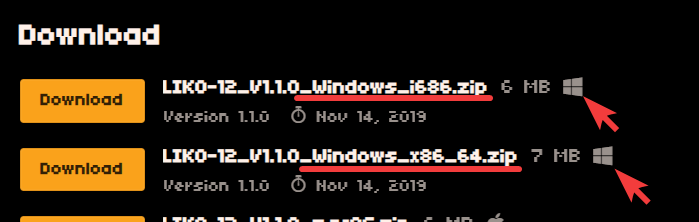
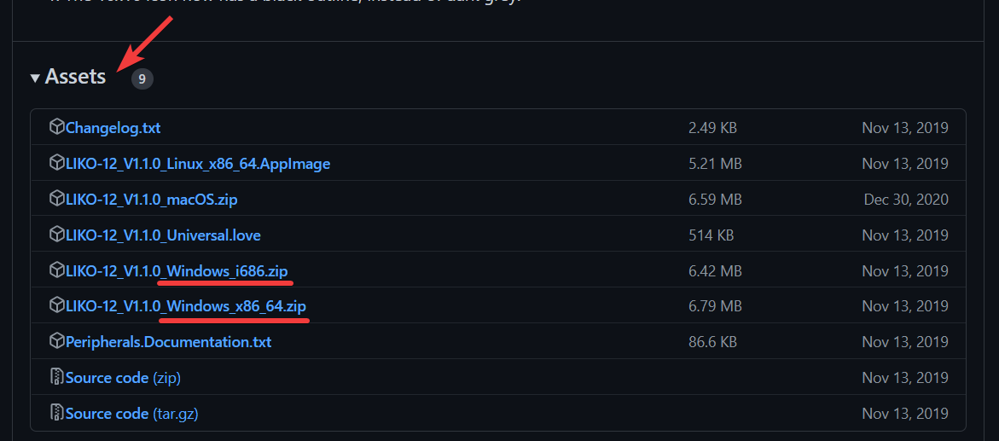
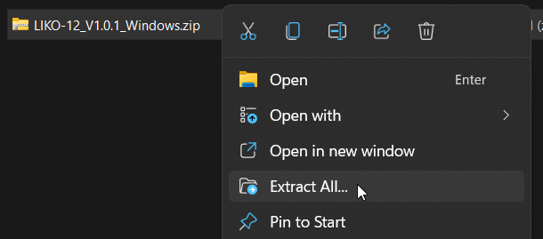
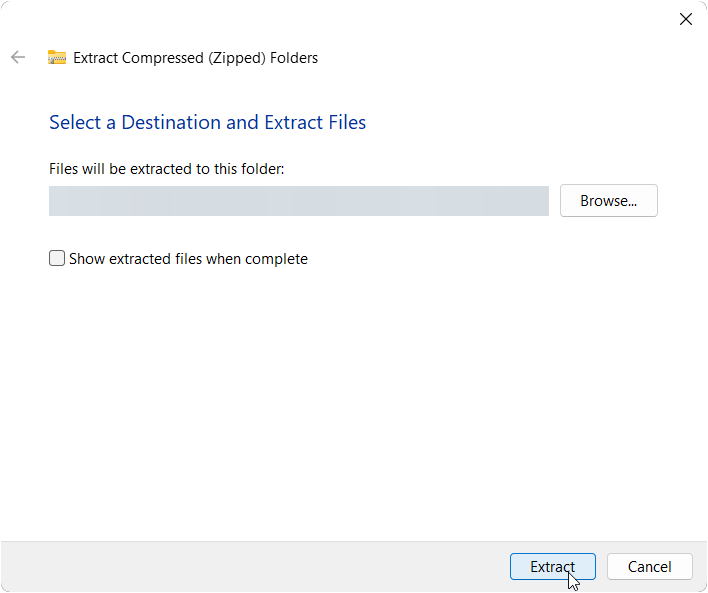
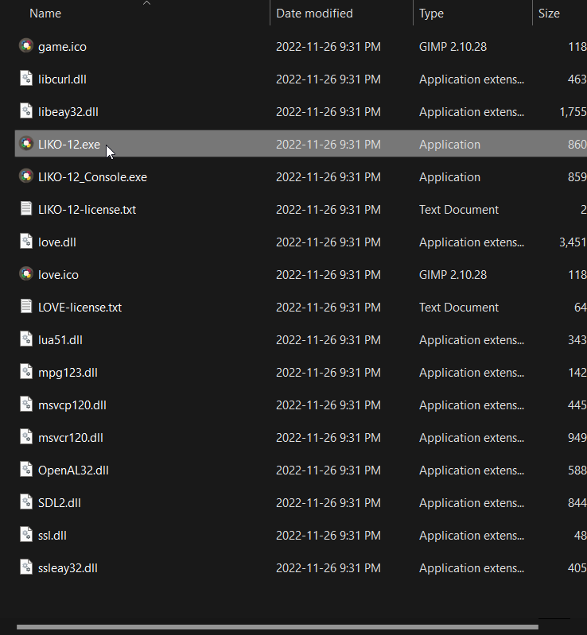
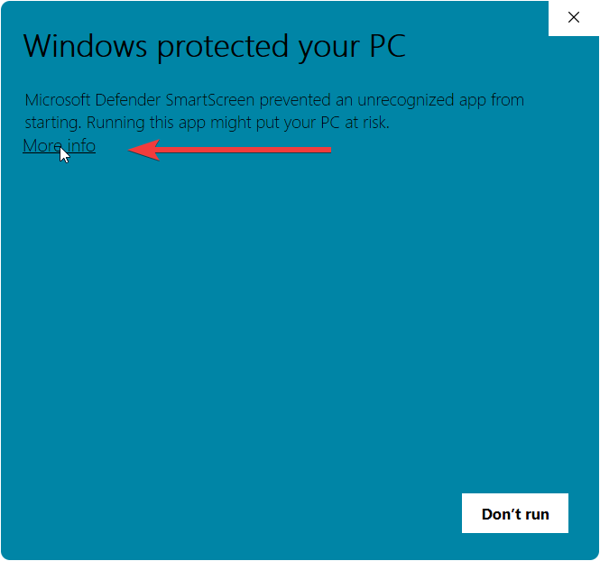
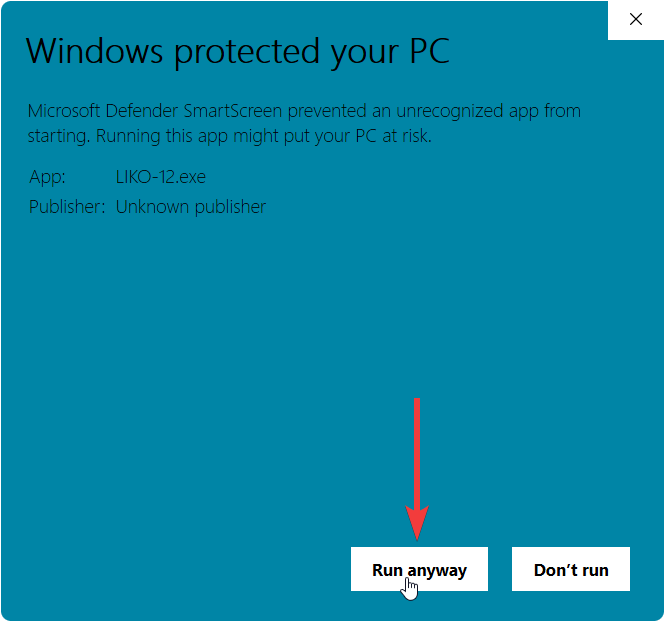
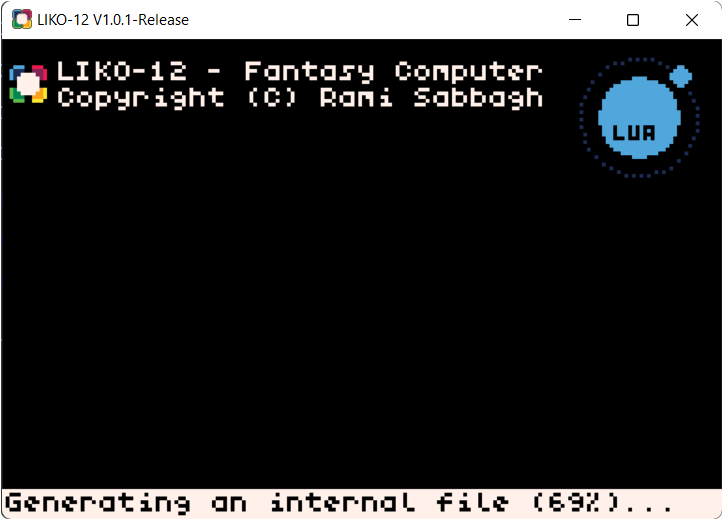
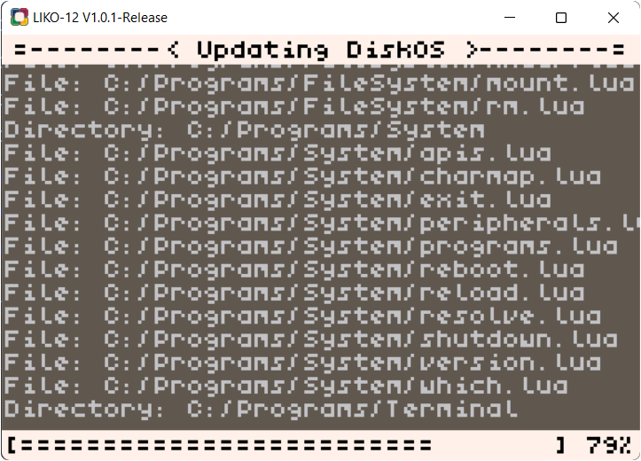
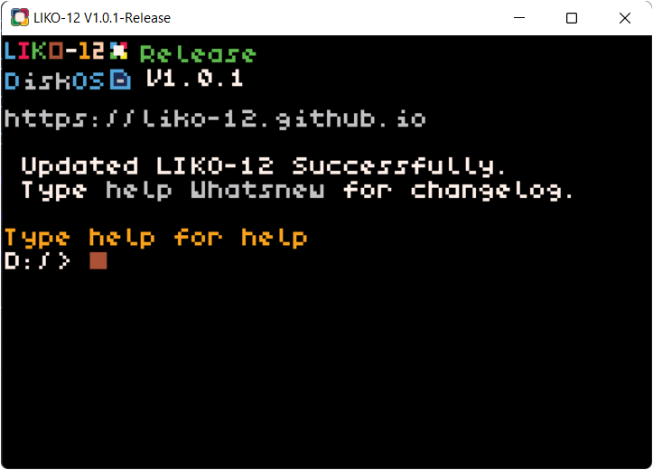

## Get a release

The first step would be to download the latest release from any of the following providers:

- [Itch.io](https://ramilego4game.itch.io/liko12).

- [GitHub Releases](https://github.com/LIKO-12/LIKO-12/releases).

Pick the file that ends with:

- `_Windows_i686.zip` if you have a 32-bit system.
- `_Windows_x86_64.zip` if you have a 64-bit system.

## Extract the downloaded archive

1. Right click the archive and click the `Extract All` option.

2. Click the `Extract` button.

3. Open the extracted folder and open the `LIKO-12.exe` executable.
    - It's might be simply displayed as `LIKO-12` on your system.

4. If Windows complained about the application being unrecognized tell it to run anyway.

    1. Click on `More Info`.

    

    2. Confirm with`Run Anyway`.

    

## The first run of LIKO-12

In some versions it would display something about generating an internal file.

And then followed by a about installing/updating DiskOS

> DiskOS is the imaginary operating system that LIKO-12 runs.

- Don't worry about files being overwritten in your C drive, the logs being displayed on the screen are for the sandboxed virtual filesystem of LIKO-12. It's not your real computer's files.

Those would only show when running a new release for the first time, don't close the application while they are in-progress.

## You're ready

Once you reach the terminal you're good to go.
